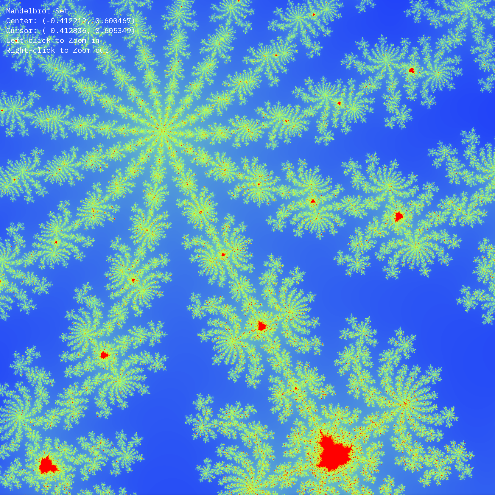

# MandelbrotSet

MandelbrotSet Project For CISP400
Readme By WaitingKeptYouHuh 

## Usage
- Left Click to zoom in
- Right Click to zoom out

## Building
### CMake
- With IDE: Click Run
- Without IDE: run `cmake -B build` and then `cmake --build build` in the project folder directly
### g++
We also supply a makefile, which can be used by running the `make` command. You will need SFML2 installed on your machine. It will not work with SFML3. CMake fixes this issue, by caching a local copy of SFML2, separate from your OS package manager.

## Dependencies
### Fedora
- `glew-devel`
- `SDL2-devel`
- `SDL2_image-devel`
- `glm-devel`
- `freetype-devel`
- `openal-soft-devel`
- `libvorbis-devel`
- `flac-devel`

## CachyOS / Arch Linux / EndeavourOS
- I'll update this once I figure it out

### Void Linux
- Good luck lmao mine does not have X server (yet)
